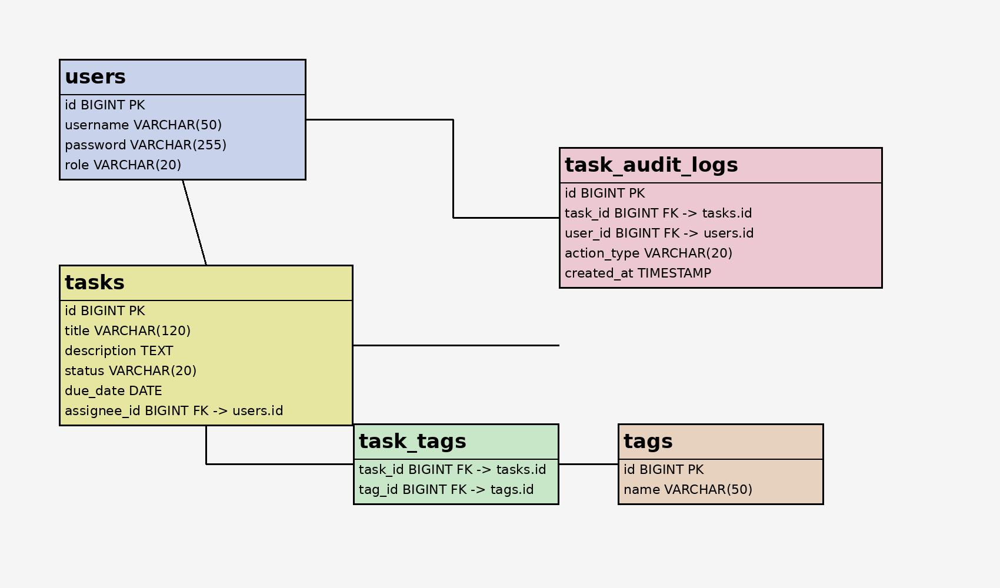

# 🗂 Task Management App（業務管理アプリ）

Spring Boot を用いて開発した、業務向けタスク管理アプリです。  
単なるCRUDではなく、「業務ルール」「認可」「監査ログ」を意識した設計を行っています。

---

## 📌 アプリ概要

ユーザーがタスクを作成・管理し、進捗をステータスで管理できるアプリです。

実務を想定し、以下の観点を重視しています。

- 状態遷移のルール管理
- 権限による操作制御（認可）
- 操作履歴の記録（監査ログ）
- Service層への業務ロジック集約

---

★ 開発背景

業務アプリにおいて重要な以下を実践するために開発しました。

単純なCRUDではなく「業務ルールの実装」

認可・監査ログなど実務的な設計

Service層への責務集約

---

## E-R図



## 設計概要

- users と tasks は 1対多で関連します
- tasks と task_audit_logs は 1対多で関連します
- tasks と tags は task_tags を介して多対多で関連します
- task_audit_logs では、どのユーザーがどのタスクに対して何を行ったかを記録します
>>>>>>> 0f237c4 (Add ER diagram section to README)

## 🎯 主な機能

### ✅ タスク管理
- タスク作成（タイトル必須）
- タスク一覧表示
- タスク編集
- タスク削除

### 🔄 ステータス管理
- TODO（未着手）
- IN_PROGRESS（対応中）
- DONE（完了）

### 状態遷移ルール
- TODO → IN_PROGRESS
- IN_PROGRESS → DONE
- IN_PROGRESS → TODO（差し戻し）
- DONE → IN_PROGRESS（再開）

※ TODO → DONE は禁止

---

### 🔐 認可（Authorization）

業務アプリを想定し、操作権限を制御しています。

- USER
  - 自分の担当タスクのみ操作可能
- ADMIN
  - 全タスク操作可能

認可ロジックは **Service層に実装** しています。

---

### 📝 監査ログ（Audit Log）

すべての操作を記録します。

- CREATE（作成）
- UPDATE（更新）
- STATUS_CHANGE（状態変更）
- DELETE（削除）

---

## 🏗 技術スタック

| 分類 | 技術 |
|------|------|
| Backend | Java 17 / Spring Boot |
| ORM | Spring Data JPA |
| DB | PostgreSQL |
| Build | Gradle |
| View | Thymeleaf / Bootstrap |
| Test | JUnit / Mockito |

---

## 🧠 設計のポイント

### ① ドメインルールの分離
- 状態遷移は `Task` エンティティ内で管理
- Serviceは「操作の指示」に集中

### ② 認可の責務
- Controllerではなく **Service層で認可を実装**
- UI/APIに依存しない設計

### ③ 監査ログの一元管理
- すべての操作でログを記録
- 業務トレーサビリティを確保

---

## 🧪 テスト

Service層に対して単体テストを実施しています。

- タスク作成 / 更新 / 削除
- 状態遷移
- 認可（USER / ADMIN）
- 監査ログの記録確認

---

## 🖥 画面一覧

- タスク一覧画面
- 

- タスク作成画面
- 

- タスク編集画面（監査ログ表示あり）
- 

---

今後の改善予定

Spring Securityとの連携（ログイン機能）

ユーザー管理（usersテーブル）

権限の拡張（プロジェクト単位など）

REST API化 → フロント分離（Next.js）

クラウドデプロイ（Render / Railway / AWS）

---

## 🚀 起動方法

### 前提
- Java 17
- PostgreSQL

### 起動

```bash
./gradlew bootRun
