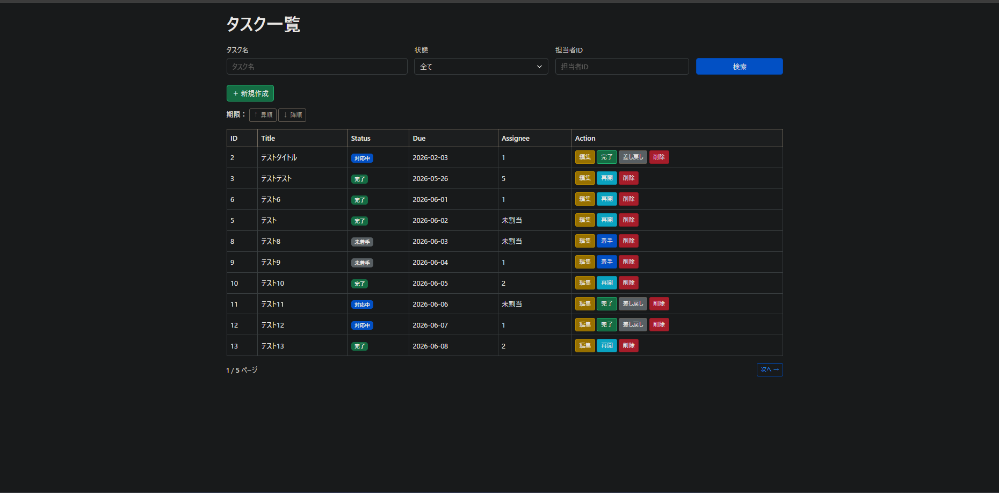
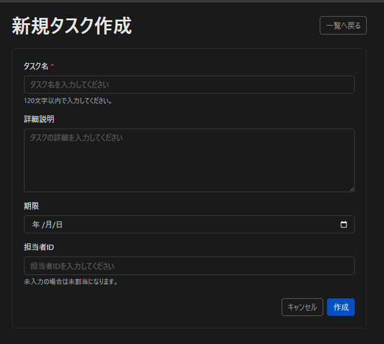
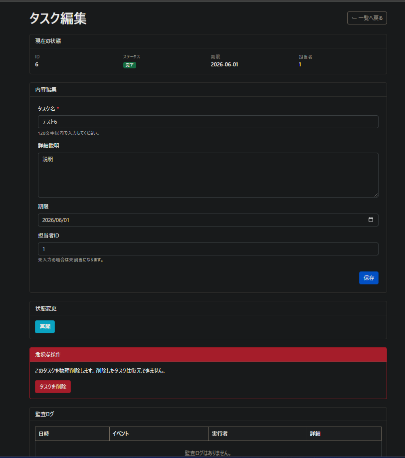

# 🗂 Task Management App（業務管理アプリ）

Spring Bootを使用して開発した業務向けタスク管理アプリです。

タスクのCRUD、検索・フィルタ、状態遷移、監査ログ、
Spring Securityによるログイン・認証・認可を実装しています。

---

## 📌 アプリ概要

ユーザーがタスクを作成・管理し、進捗をステータスで管理できるアプリです。

実務を想定し、以下の観点を重視しています。

- 状態遷移のルール管理
- 権限による操作制御（認可）
- 操作履歴の記録（監査ログ）
- Service層への業務ロジック集約

---

## 🎯 開発背景

業務アプリにおいて重要な以下の要素を実践するために開発しました。

- 単純なCRUDにとどまらない業務ルールの実装
- 認可・監査ログなどを含む実務的な設計
- Service層への責務集約

---

## E-R図


※tags機能は将来拡張を想定した設計です※

---

## 設計概要

- users と tasks は 1対多で関連します
- tasks と task_audit_logs は 1対多で関連します
- tasks と tags は task_tags を介して多対多で関連します
- task_audit_logs では、どのユーザーがどのタスクに対して何を行ったかを記録します

## 実装済み機能

- ユーザーログイン
- Spring Securityによる認証・認可
- タスク作成・一覧・編集・削除
- タスク状態変更
- タイトル検索
- ステータス・担当者フィルタ
- ソート
- ページネーション
- 監査ログ
- Bootstrapによる画面レイアウト

### ✅ タスク管理
- タスク作成（タイトル必須）
- タスク一覧表示
- タスク編集
- タスク削除

### 🔄 ステータス管理
- TODO（未着手）
- IN_PROGRESS（対応中）
- DONE（完了）

### 状態遷移ルール
- TODO → IN_PROGRESS
- IN_PROGRESS → DONE
- IN_PROGRESS → TODO（差し戻し）
- DONE → IN_PROGRESS（再開）

※ TODO → DONE は禁止

---

### 🔐 認可（Authorization）

業務アプリを想定し、操作権限を制御しています。

- USER
  - 自分の担当タスクのみ操作可能
- ADMIN
  - 全タスク操作可能

認可ロジックは **Service層に実装** しています。

---

### 📝 監査ログ（Audit Log）

すべての操作を記録します。

- CREATE（作成）
- UPDATE（更新）
- STATUS_CHANGE（状態変更）
- DELETE（削除）

---

## 🏗 技術スタック

| 分類 | 技術 |
|------|------|
| Language | Java 17 |
| Framework | Spring Boot 4.0.2 |
| Security | Spring Security |
| ORM | Spring Data JPA |
| Database | PostgreSQL 17 |
| Migration | Flyway |
| Build Tool | Gradle |
| Frontend | Thymeleaf / Bootstrap |
| Container | Docker / Docker Compose |
| Testing | JUnit 5 / Mockito |
| Version Control | Git / GitHub |

---

## 🧠 設計のポイント

### ① ドメインルールの分離
- 状態遷移は `Task` エンティティ内で管理
- Serviceは「操作の指示」に集中

### ② 認可の責務
- Controllerではなく **Service層で認可を実装**
- UI/APIに依存しない設計

### ③ 監査ログの一元管理
- タスクに対する主要な操作を監査ログとして記録します。
- 業務トレーサビリティを確保

---

## 🧪 テスト

Service層に対して単体テストを実施しています。

- タスク作成 / 更新 / 削除
- 状態遷移
- 認可（USER / ADMIN）
- 監査ログの記録確認

---

## 🖥 画面一覧

### タスク一覧画面



### タスク作成画面



### タスク編集画面（監査ログ表示あり）



---

## ★ 今後の改善予定

- REST API化
- Next.jsとのフロント分離
- Renderへのデプロイ
- AWSへの移行
- 権限の拡張（プロジェクト単位など）

---

## 🚀 起動方法

### 前提

- Docker Desktop
- Git

### Dockerで起動

```bash
docker compose up --build

アクセス先：http://localhost:8080

停止：docker compose down

※ docker compose down -v を実行すると、PostgreSQLのデータが削除されます。

## 🌿 Git運用

main / develop / feature ブランチによる簡易Git Flowで運用しています。

- main：リリース可能な安定版
- develop：次回リリース向けの統合ブランチ
- feature：機能単位の作業ブランチ

## 📦 開発環境

- Git Flow（main / develop / feature）
- Docker Compose
- FlywayによるDBマイグレーション
- PostgreSQL
